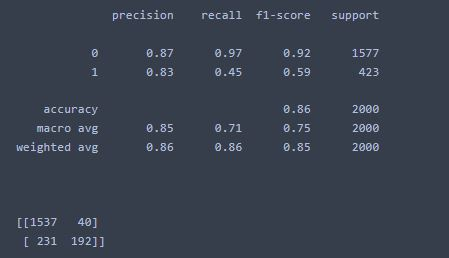

# <centre> RetainMe-Predicting-Customer-Retention </centre>
### <centre> by </centre>
## <centre> Shedrack David </centre>

# Aim
This project was conducted to predict the possibility of churn among bank customers and analyze the various reasons why it may occur, as well as the circumstances surrounding their decision.

# About dataset

Every bank wants to hold there customers for sustaining their business so the ABC Multinational bank. Bank ABC (incorporated as Arab Banking Corporation B.S.C) is an international bank headquartered in Manama, Kingdom of Bahrain. Our network spreads across five continents, covering countries in the Middle East, North Africa, Europe, the Americas and Asia.

Bank ABC, founded in 1980, is listed on the Bahrain Bourse and our major shareholders are the Central Bank of Libya and Kuwait Investment Authority.

Bank ABC is a leading provider of Trade Finance, Treasury, Project & Structured Finance, Syndications, Corporate & Institutional Banking as well as Islamic Banking services. We are also expanding our retail banking network in the MENA region.

Bank ABC is licensed as a conventional wholesale bank by the Central Bank of Bahrain. The dataset used for this model training is for ABC Multistate bank, the dataset has 10000 entries with no duplicates or missing values, it has 10000 rows and 12 columns with following column names:

customer_id, unused variable.
credit_score, used as input.
country, used as input.
gender, used as input.
age, used as input.
tenure, used as input.
balance, used as input.
products_number, used as input.
credit_card, used as input.
active_member, used as input.
estimated_salary, used as input.
churn, used as the target. 1 if the client has left the bank during some period or 0 if he/she has not.

# Summary of findings
- gender groups who churn the most is female
- the most dorminant people in the bank are of the age range 19 - 39
- the age groups who churn the most are of the age range 40 - 59
- the most active and inactive age group is young adults, i.e 19 - 39
- most customers earn low salaries and have balance 
- most people who churn have low balance and earn low salary
- the most important feature to determine churn is age

# Key finding

> Age is the most importannt feaauture to determine churn possibility, middle age group churn the most from all other age groups, there could be several reasons why this happens

- Career Plateau: Middle-aged employees may have been with the organization for a while and may have reached a plateau in their careers. They may feel like they have hit a ceiling in terms of opportunities for advancement, and may become bored or disillusioned with their work.

- Family Responsibilities: Middle-aged employees may be juggling significant family responsibilities, such as caring for children or aging parents. These responsibilities can be challenging to balance with work demands, and may make them more likely to leave an organization if they feel that their work is interfering with their personal life.

- Health Issues: Middle-aged employees may be more prone to health issues that can affect their ability to work. For example, they may develop chronic health conditions that make it difficult to maintain a full-time job. If their employer is not able to provide the necessary support, such as flexible work arrangements or accommodations, they may choose to leave the organization.

- Generational Differences: Middle-aged employees may feel like they don't fit in with the younger or older generations of employees in the organization. This can create feelings of isolation or disconnection, and may lead them to seek employment elsewhere.

- Lack of Job Satisfaction: Middle-aged employees may have higher expectations for job satisfaction and fulfillment, and may be less willing to tolerate a job that doesn't meet those expectations. If they feel like their work is not meaningful or fulfilling, they may be more likely to leave the organization.

> Another important feature to determine churn possibility is salary and it is discovered that most of the customers earn low salaries and have low balance in their account. people with low salary will churn the most in other to meet ends need

# Model Evaluation

